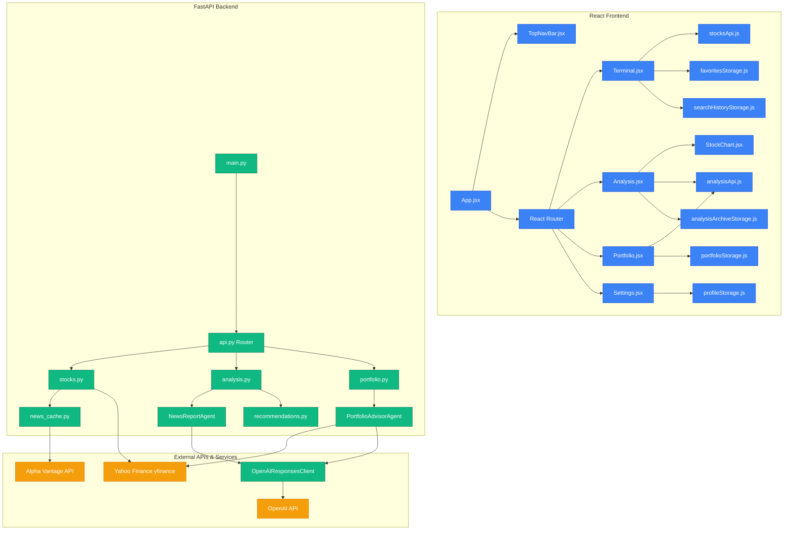
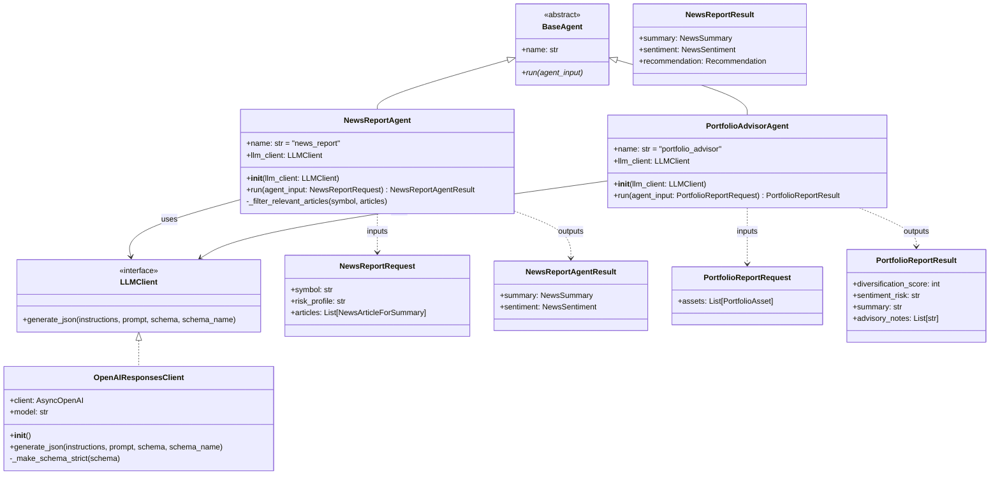
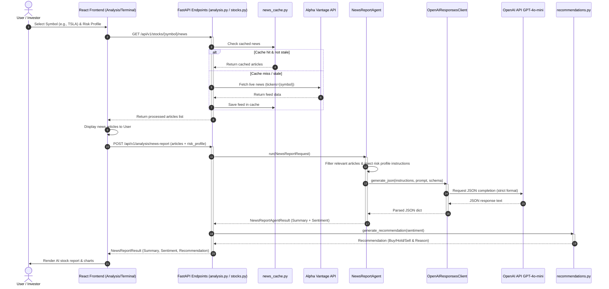

# AISNA - AI Stock News Analyzer

## Project Description

AISNA (AI Stock News Analyzer) is an application that allows users to enter a stock ticker (e.g., AAPL, TSLA, NVDA) and receive:

- latest relevant news about the company
- an AI-generated summary
- sentiment analysis of the news
- a simple Buy / Hold / Sell recommendation tailored to the user's risk profile

The main AI workflow uses two agents:

- **News Report Agent** — summarizes supplied news articles and analyzes sentiment in one OpenAI call, with prompt instructions adjusted dynamically based on the user's risk profile
- **Portfolio Advisor Agent** — analyzes a multi-stock portfolio, assesses diversification and collective news sentiment, and returns strategic advisory notes

This project is developed as part of the Software Development Methods laboratory course at the Faculty of Mathematics and Computer Science, University of Bucharest.

## Current Backend Features

- OpenAI-backed News Report Agent for summary and sentiment analysis
- Risk profile support (Conservative / Balanced / Aggressive) — adjusts LLM prompt focus per user preference
- Deterministic Buy / Hold / Sell recommendation logic based on sentiment results
- Portfolio Advisor Agent for collective sentiment risk assessment and diversification scoring
- Evaluation workflow for summary quality, sentiment labels, recommendation logic, and risk profile focus
- FastAPI endpoints exposed under `/api/v1`

## System Architecture & UML Diagrams

This section describes the high-level architecture, module design, and workflow sequence of AISNA.

### 1. Component & Architecture Diagram
The diagram below illustrates the communication flow between the React Frontend (Pages, Components, and Local Storage Services), the FastAPI Backend (Endpoints, Cache, recommendations service, and AI Agents), and the External APIs (Yahoo Finance, Alpha Vantage, and OpenAI):



### 2. Class & Interface Relationships
This diagram shows the main backend agents, client interfaces, and schemas:



### 3. AI Analysis Sequence Workflow
This sequence diagram shows the step-by-step lifecycle of an AI stock report request (including cache checks, yfinance/Alpha Vantage queries, risk profile instructions injection, and final OpenAI structured completions):



## Backend Setup

From the repository root:

```bash
python -m venv .venv
```

On macOS / Linux:

```bash
source .venv/bin/activate
pip install -r backend/requirements.txt
```

On Windows PowerShell:

```powershell
.\.venv\Scripts\Activate.ps1
pip install -r backend\requirements.txt
```

Create `backend/.env` from `backend/.env.example` and set:

```env
OPENAI_API_KEY=your_api_key_here
ALPHA_VANTAGE_API_KEY=your_alpha_vantage_key_here
OPENAI_MODEL=gpt-4o-mini
OPENAI_REASONING_EFFORT=low
OPENAI_TIMEOUT_SECONDS=30
```

Run the backend:

```bash
cd backend
uvicorn app.main:app --reload --host 127.0.0.1 --port 8010
```

API docs:

```text
http://127.0.0.1:8010/docs
```

## Frontend Setup

```bash
cd frontend
npm install
npm run dev
```

Frontend runs at `http://localhost:5173`.

## AI Agent Endpoints

### News Report

```text
POST /api/v1/analysis/news-report
```

Generates a structured summary and sentiment analysis from one OpenAI call, then applies local deterministic logic for the Buy / Hold / Sell recommendation. Accepts an optional `risk_profile` field (`Conservative`, `Balanced`, or `Aggressive`) to adjust the LLM prompt focus.

### Portfolio Report

```text
POST /api/v1/analysis/portfolio-report
```

Accepts a list of portfolio assets (symbol, shares, average price, current price) and returns a diversification score, collective sentiment risk level, a summary, and strategic advisory notes.

## Evaluation Workflow

The backend includes pytest-based evaluation tests for the AI agents. The fixture data is synthetic and can be replaced or extended once real labeled data is collected.

Run from the `backend` directory:

```bash
pytest tests/evaluation
```

Evaluation files:

- `backend/app/evaluation/metrics.py`
- `backend/app/evaluation/schemas.py`
- `backend/tests/evaluation/fixtures/agent_evaluation_cases.json`
- `backend/tests/evaluation/test_agent_evaluation.py`
- `backend/tests/evaluation/fixtures/risk_profile_evaluation_cases.json`
- `backend/tests/evaluation/test_risk_profile_evaluation.py`

## Tests

The backend has two test suites located in [`backend/tests/`](backend/tests/):

- **API tests** ([`backend/tests/api/`](backend/tests/api/)) — verify that the FastAPI endpoints behave correctly using stubs instead of real OpenAI calls
- **Evaluation tests** ([`backend/tests/evaluation/`](backend/tests/evaluation/)) — verify the quality of AI agent outputs against fixture-based expected results

Run all tests from the `backend` directory:

```bash
pytest tests/api -v
pytest tests/evaluation -v
```

## CI/CD Pipeline

The project uses GitHub Actions for continuous integration. The pipeline runs automatically on every push and pull request to `main` and consists of four parallel jobs:

- **Backend Tests** — runs `pytest tests/api`
- **Backend Evaluation Tests** — runs `pytest tests/evaluation`
- **Backend Lint** — runs `ruff check` to enforce code quality
- **Frontend Build** — runs `npm run build` to verify the React app compiles

Pipeline configuration: [`.github/workflows/ci.yml`](.github/workflows/ci.yml)

## AI Tools

A detailed report of all AI tools used during development (OpenAI API, Claude Code, Antigravity, Google Stitch) is available in [`tools.md`](tools.md).

## User Stories

| ID   | User Story                                                                                                                                                    | Priority | Status      |
| ---- | ------------------------------------------------------------------------------------------------------------------------------------------------------------- | -------- | ----------- |
| US1  | As a user, I want to enter a stock ticker so that I can see information about a company.                                                                      | High     | Done        |
| US2  | As a user, I want to see the latest news about the selected company so that I can understand the current context.                                             | High     | Done        |
| US3  | As a user, I want to receive an AI-generated summary of the news so that I can save time.                                                                     | High     | Done        |
| US4  | As a user, I want to see whether the overall sentiment of the news is positive, negative, or neutral so that I can quickly understand the market perception.  | High     | Done        |
| US5  | As a user, I want to receive a simple Buy / Hold / Sell recommendation so that I can interpret the news more easily.                                          | Medium   | Done        |
| US6  | As a user, I want to see the reasoning behind the recommendation so that I can understand why that decision was suggested.                                    | Medium   | Done        |
| US7  | As a user, I want to save favorite tickers so that I can track them more easily.                                                                              | Medium   | Done        |
| US8  | As a user, I want to see my search history so that I can quickly return to previously analyzed companies.                                                     | Medium   | Done        |
| US9  | As a user, I want a clean and easy-to-use interface so that I can quickly access the information I need.                                                      | High     | In Progress |
| US10 | As a developer, I want to automatically test the main functionalities so that I can reduce errors and ensure the application works correctly.                 | High     | In Progress |
| US11 | As a developer, I want a CI/CD pipeline so that builds and tests run automatically on each commit.                                                            | Medium   | Done        |
| US12 | As a developer, I want to evaluate the AI agents' output so that I can verify that the results are coherent and useful.                                       | High     | In Progress |
| US13 | As a user, I want to view an interactive historical stock price chart with sentiment overlays so that I can correlate news with price changes.                | Medium   | To Do       |
| US14 | As a user, I want my selected risk profile to customize the AI news report focus so that the analysis aligns with my personal investment strategy.           | Medium   | Done        |
| US15 | As a user, I want to simulate holding a portfolio of stocks and receive an AI-generated portfolio risk assessment so that I can monitor collective sentiment.  | Low      | Done        |
